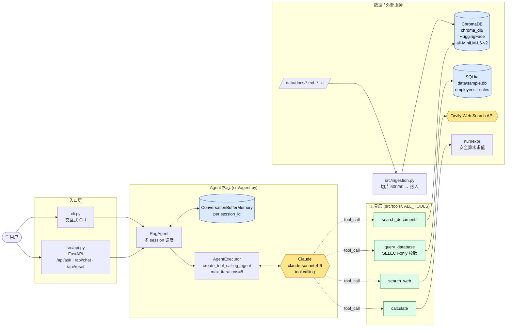

# RAG Agent Demo — Agentic RAG with Claude + LangChain

一个完整的 **Agentic RAG** 示例项目:Claude 作为决策核心,自主选择
**本地文档检索 / SQL 查询 / Web 搜索 / 计算器** 四个工具回答用户问题,
支持多轮对话,提供 **CLI** 和 **REST API** 两种入口。

> **想直接跑起来?** 看 **[RUNNING.md](./RUNNING.md)** —— 包含每一步的命令、预期输出、常见错误排查。

## 特性

-  Claude `claude-sonnet-4-6` Tool Calling
-  ChromaDB 本地向量库 + HuggingFace Embeddings
-  四个工具:文档检索、只读 SQL、Tavily Web 搜索、安全计算器
-  多 session 隔离的对话记忆
-  FastAPI Web 服务 + 交互 CLI

## 架构



**一句话流程**:用户提问 → `RagAgent` 按 `session_id` 取/建对话记忆 → `AgentExecutor` 把问题 + 历史交给 Claude → Claude 根据工具 docstring 自主选择工具 → 工具命中本地向量库 / SQLite / Tavily / numexpr → 结果回灌到 Claude → 生成最终答案。**路由不在代码里,而在 LLM 的判断里**。

## 目录结构

```
rag_agent_demo/
├── README.md
├── requirements.txt
├── .env.example
├── config.py
├── cli.py
├── data/
│   ├── docs/{product_intro.md, faq.md}
│   ├── init_db.py
│   └── sample.db          # 由 init_db.py 生成
├── src/
│   ├── ingestion.py       # 文档→ChromaDB
│   ├── agent.py           # Agent 主体
│   ├── api.py             # FastAPI
│   └── tools/
│       ├── doc_search.py
│       ├── sql_query.py
│       ├── web_search.py
│       └── calculator.py
└── tests/test_agent.py
```

## 快速开始

### 1. 安装依赖

```bash
cd rag_agent_demo
python -m venv .venv && source .venv/bin/activate
pip install -r requirements.txt
```

### 2. 配置 API key

```bash
cp .env.example .env
# 编辑 .env,填入 ANTHROPIC_API_KEY 和 TAVILY_API_KEY
```

> Tavily 在 https://tavily.com 免费注册,每月有免费额度。
> 如果不需要 Web 搜索,可以留空 `TAVILY_API_KEY`,Agent 会自动跳过该工具。

### 3. 初始化数据

```bash
# 生成 SQLite 示例数据
python data/init_db.py

# 把 data/docs/ 下的文档索引到 ChromaDB
python -m src.ingestion
```

### 4. 启动

**CLI 模式**:
```bash
python cli.py
```

**Web API 模式**:
```bash
uvicorn src.api:app --reload
```

## API 用法

```bash
# 单次问答(无状态)
curl -X POST http://localhost:8000/api/ask \
  -H "Content-Type: application/json" \
  -d '{"question": "RockBot Pro 多少钱?"}'

# 多轮对话(同 session_id 保持上下文)
curl -X POST http://localhost:8000/api/chat \
  -H "Content-Type: application/json" \
  -d '{"question": "工程部最高工资是多少?", "session_id": "user-001"}'

curl -X POST http://localhost:8000/api/chat \
  -H "Content-Type: application/json" \
  -d '{"question": "那这个工资涨 15% 后是多少?", "session_id": "user-001"}'

# 重置 session
curl -X POST http://localhost:8000/api/reset \
  -H "Content-Type: application/json" \
  -d '{"session_id": "user-001"}'
```

## 示例问题(展示工具路由)

| 问题 | 触发的工具 |
|------|-----------|
| "RockBot 支持私有部署吗?" | `search_documents` |
| "工程部平均工资是多少?" | `query_database` |
| "今天 Anthropic 发布了什么新产品?" | `search_web` |
| "2024 年总营收是多少?平均每季度多少?" | `query_database` + `calculate` |
| "对比 RockBot Pro 和市场上的同类产品" | `search_documents` + `search_web` |

## 测试

```bash
pytest tests/ -v
```

## 关键文件说明

- **`src/agent.py`** — 用 `create_tool_calling_agent` 构造 Claude agent,
  通过 `ConversationBufferMemory` 实现多轮记忆。
- **`src/ingestion.py`** — 把 `data/docs/` 下文档切片(500 字符 / 50 重叠)
  并写入 ChromaDB。
- **`src/tools/sql_query.py`** — 强制只允许 SELECT,过滤 DML/DDL 关键字。
- **`src/tools/calculator.py`** — 使用 `numexpr` 安全计算,避免 `eval` 风险。

## 设计文档

详见 [docs/superpowers/specs/2026-05-25-rag-agent-design.md](../docs/superpowers/specs/2026-05-25-rag-agent-design.md)。
